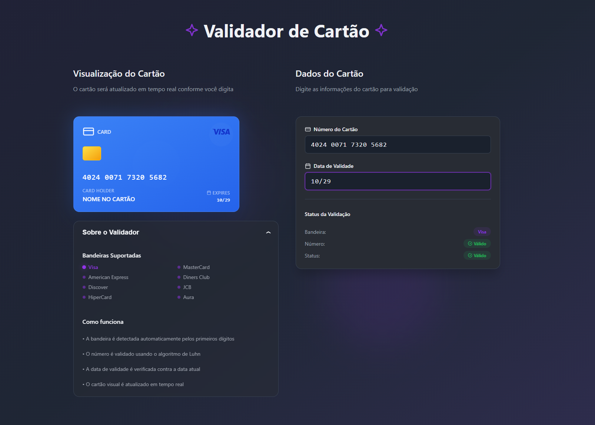

# Validador de Bandeira de Cartões

> Uma interface moderna construída em Angular para validar números de cartão de crédito em tempo real, com detecção automática de bandeiras e design responsivo.

## Introdução

O Validador de Bandeira de Cartões é uma aplicação web desenvolvida em Angular que permite ao usuário inserir dados de cartões de crédito e receber validação instantânea. O sistema identifica automaticamente a bandeira do cartão (Visa, MasterCard, Amex, etc.), verifica a validade do número usando o algoritmo de Luhn, checa a data de expiração e apresenta feedback visual em tempo real.

## ✨ Features

* **Detecção automática de bandeiras:** Suporte a Visa, MasterCard, American Express, Diners Club, Discover, JCB, Hipercard, Aura e Elo.
* **Validação pelo algoritmo de Luhn:** Confirma se o número do cartão é potencialmente válido.
* **Verificação de data de validade:** Checa se o cartão está expirado.
* **Formatação automática dos campos:** Máscara para número do cartão (`0000 0000 0000 0000`) e data de validade (`MM/AA`).
* **Feedback visual em tempo real:** Atualização instantânea do status conforme o usuário digita.
* **Design responsivo:** Interface adaptável para desktop e dispositivos móveis.
* **Componentização:** Arquitetura baseada em componentes reutilizáveis (Smart/Dumb components).
* **Visualização dinâmica do cartão:** Exibe os dados digitados em um cartão virtual estilizado com gradientes específicos para cada bandeira.

## 🖼️ Screenshot



## 🛠️ Tecnologias Utilizadas

* **Angular 18+** (Framework principal)
* **TypeScript** (Tipagem estática e desenvolvimento seguro)
* **SCSS** (Estilização modular e design system)
* **Angular Signals** (Gerenciamento reativo de estado)
* **RxJS** (Programação reativa)

## 📂 Estrutura do Código

O projeto é organizado com uma arquitetura clara para separar responsabilidades, facilitando a manutenção e escalabilidade.

```plaintext
/src
├── app/
│   ├── components/       # Componentes reutilizáveis (dumb components)
│   │   ├── credit-card/
│   │   ├── credit-card-form/
│   │   └── accordion-info/
│   ├── interfaces/       # Definições de tipos e interfaces
│   ├── app.component.ts  # Componente principal (smart component)
│   └── ...
├── assets/               # Imagens das bandeiras e outros recursos estáticos
├── _variables.scss       # Design system e variáveis globais de SCSS
└── styles.scss           # Estilos globais da aplicação
```

* **`app/components/`**: Contém todos os componentes visuais reutilizáveis, organizados por funcionalidade. Eles são "dumb components", recebendo dados via `@Input` e emitindo eventos via `@Output`.
* **`app/interfaces/`**: Define os tipos e interfaces TypeScript usados para garantir a tipagem segura dos dados em toda a aplicação.
* **`app.ts`**: Componente principal que gerencia o estado da aplicação ("smart component") e integra os demais componentes.
* **`assets/`**: Armazena imagens das bandeiras dos cartões e outros recursos estáticos.
* **`_variables.scss`**: Centraliza variáveis de cor, espaçamento e fontes para manter o design consistente.
* **`styles.scss`**: Define estilos globais aplicados à aplicação.

## 🤖 Ferramentas de IA Utilizadas

* **Lovable:** Utilizado para a prototipação e geração inicial da interface de usuário (UI), fornecendo um ponto de partida visual e feedbacks interativos que aceleraram o design.
* **GitHub Copilot:** Empregado extensivamente durante o desenvolvimento para autocompletar código, refatorar componentes de React para Angular, gerar lógica de validação (como o algoritmo de Luhn), depurar erros de template e, finalmente, para criar esta documentação.

## 🚀 Começando

Siga os passos abaixo para rodar o projeto localmente:

### Pré-requisitos

* [Node.js](https://nodejs.org/en/) (versão 18 ou superior)
* [Angular CLI](https://angular.io/cli) (`npm install -g @angular/cli`)

### Instalação e Execução

1. Clone o repositório:

    ```bash
    git clone https://github.com/Nickcarv18/github-copilot-validador-bandeira-cartoes.git
    ```

2. Navegue até a pasta do projeto:

    ```bash
    cd github-copilot-validador-bandeira-cartoes
    ```

3. Instale as dependências:

    ```bash
    npm install
    ```

4. Inicie o servidor de desenvolvimento:

    ```bash
    ng serve
    ```

Acesse [http://localhost:4200](http://localhost:4200) no navegador para visualizar a aplicação.

## 🔗 Deploy

A aplicação está disponível para acesso e teste através do link abaixo:

**[https://nickcarv18.github.io/github-copilot-validador-bandeira-cartoes/](https://nickcarv18.github.io/github-copilot-validador-bandeira-cartoes/)**

[](https://nickcarv18.github.io/github-copilot-validador-bandeira-cartoes/)
